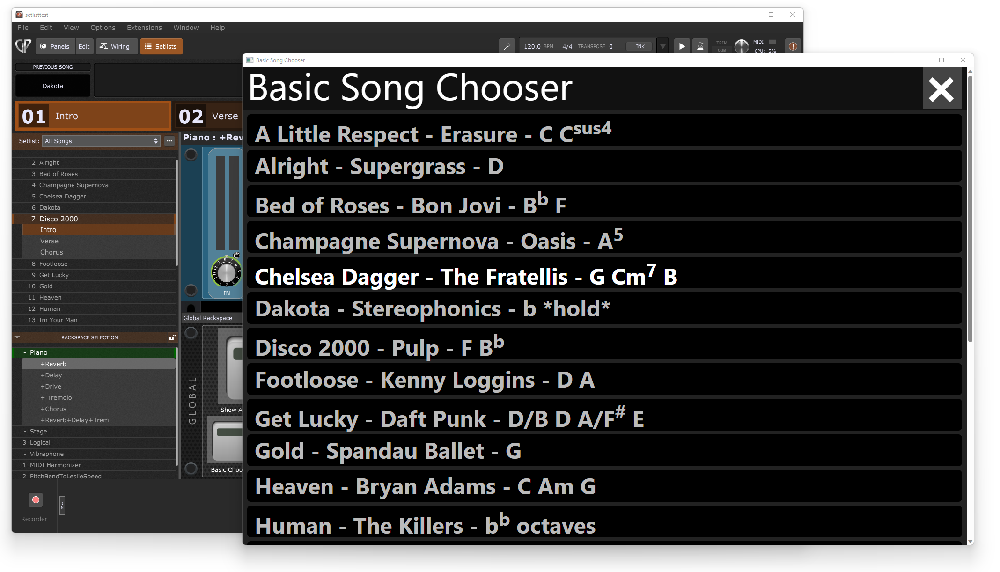

<a name="readme-top"></a>

<!-- PROJECT LOGO -->
<br />
<div align="center">
  <a href="https://boulden.digital/ target="_blank"">
    
  </a>

  <h3 align="center">Basic Song Chooser</h3>

  <p align="center">
    An example extension for <a href="https://www.gigperformer.com/" target="_blank">Deskew GigPerformer</a> using a web-based UI.
  </p>
</div>


<!-- TABLE OF CONTENTS -->
<details>
  <summary>Table of Contents</summary>
  <ol>
    <li>
      <a href="#about-the-project">About The Project</a>
      <ul>
        <li><a href="#built-with">Built With</a></li>
      </ul>
    </li>
    <li>
      <a href="#getting-started">Getting Started</a>
      <ul>
        <li><a href="#prerequisites">Prerequisites</a></li>
        <li><a href="#installation">Installation</a></li>
      </ul>
    </li>
    <li><a href="#building">Building</a></li>
    <li><a href="#operating">Operating</a></li>
    <li><a href="#contributing">Contributing</a></li>
    <li><a href="#license">License</a></li>
    <li><a href="#contact">Contact</a></li>
    <li><a href="#acknowledgments">Acknowledgments</a></li>
  </ol>
</details>


<!-- ABOUT THE PROJECT -->
## About The Project

<div align="center">
    
</div>

The purpose of this example project is to illustrate how to build a Gig Performer extension using HTML, CSS and JavaScript to build the UI as opposed to a system like JUCE or creating graphical elements long-hand in C++ code. Instead, you create a single HTML page whereby you can bind pseudo-functions within JavaScript to C++ functions in your code that can, in turn, access the GigPerformer API. It is a "Hello World" type extension to show what is possible as a starting point. What the extension actually does is to pop-up a window that displays the current set list in a touchscreen friendly format allowing you to easily select songs from list (by touching the song name) and GigPerformer will switch you to that song.

The intention is to give you a boiler-plate starting point to write your own extensions using HTML and JavaScript for the front-end alongside C++ for the back end. It illuistrates the basic techniques for 2-way binding of functions within the C++ code of the back end to functions embedded within the JavaScript code of the front end. It is my hope that it will enable more developers get into creating GigPerformer extensions where they can leverage the knowledge they already have of HTML, CSS and JavaScript for the UI and only need to delve into C++ coding for the actual interaction with the GigPerformer API.


<p align="right">(<a href="#readme-top">back to top</a>)</p>


### Built With

* [![cplusplus][cplusplus-shield]][cplusplus-url]
* [![JavaScript][JavaScript.com]][JavaScript-url]
* [![HTML5][HTML5-shield]][HTML5-url]
* [![css3][css3-shield]][css3-url]
* [![gpsdk][gpsdk-shield]][gpsdk-url]
* [![saucer][saucer-shield]][saucer-url]


<p align="right">(<a href="#readme-top">back to top</a>)</p>


<!-- GETTING STARTED -->
## Getting Started

Simply download the code or clone it to a local repository.

### Prerequisites

You will need a C++ compiler and some form of text editor or IDE to add your code.  I personally use [Microsoft VSCode](https://code.visualstudio.com/).

The build process is handled by [CMAKE](https://cmake.org/) which you will need to install before building the project. 

If you wish to clone the repository and track your own changes to the code, you will need [Git](https://git-scm.com/).

If you can use [NPM](https://www.npmjs.com/) or [YARN](https://yarnpkg.com/) you will want to globally install the [Saucer App](https://www.npmjs.com/package/saucer-app) before building so that it can perform the "embedding" step of each build: 

`npm install -g saucer-app`

`yarn global add saucer-app`

There are also GitHub Actions available for [Saucer CLI](https://github.com/saucer/saucer-cli/actions) for those who want to automate builds.

### Installation

1. Clone the repo
   ```sh
   git clone https://github.com/daveboulden/gp-basic-songchooser.git
   ```
2. Change the `PROJECT_VERSION` and `PROJECT_NAME` values in `CMakeLists.txt` to suit your own project
   ```cmake
    set (PROJECT_VERSION "1.0")
    set (PROJECT_NAME "BasicSongChooser")
   ```
3. All the C++ code for your project can be added to `LibMain.h` and `LibMain.cpp`. Alternatively you can create a new class for your code and `#include` it into `LibMain`.
4. The `content` directory contains all the HTML, CSS, JavaScript and image asset files for the UI of your project. 

<p align="right">(<a href="#readme-top">back to top</a>)</p>


<!-- USAGE EXAMPLES -->
## Building

Use the supplied scripts to build your project:

* Windows - `build.cmd`
* Mac - `build.sh`

The build script will automatically scan your `content` directory and embed the HTML, CSS, JavaScript and image asset files into your project. The encoded files are stored in the `embedding` directory that will be generated the first time you build the project. It will also download the latest version of the [Saucer](https://saucer.github.io/) library which is the abstraction layer between your code and the web-rendering framework appropriate to your platform. [Saucer](https://saucer.github.io/) will then, in turn, automatically download the latest version of the web-rendering framework appropriate to your PC or Mac (currently `WebView2` on Windows or `Qt5/6` on Mac).

<p align="right">(<a href="#readme-top">back to top</a>)</p>


<!-- OPERATION EXAMPLES -->
## Operating

The extension listens for a specific widget so that you can open the Basic Song Chooser by pressing a button widget. Just give the widget an `OSC/Script Name` of: **showChooser** 

<div align="center">
    
</div>


<!-- CONTRIBUTING -->
## Contributing

Contributions are what make the open source community such an amazing place to learn, inspire, and create. Any contributions you make are **greatly appreciated**.

If you have a suggestion that would make this better, please fork the repo and create a pull request. You can also simply open an issue with the tag "enhancement".
Don't forget to give the project a star! Thanks again!

1. Fork the Project
2. Create your Feature Branch (`git checkout -b feature/AmazingFeature`)
3. Commit your Changes (`git commit -m 'Add some AmazingFeature'`)
4. Push to the Branch (`git push origin feature/AmazingFeature`)
5. Open a Pull Request

<p align="right">(<a href="#readme-top">back to top</a>)</p>


<!-- LICENSE -->
## License

Distributed under the MIT License. See `LICENSE.txt` for more information.

<p align="right">(<a href="#readme-top">back to top</a>)</p>


<!-- CONTACT -->
## Contact

Your Name - [Dave Boulden](https://boulden.digital) - dave@da-media.co.uk

Project Link: [https://github.com/daveboulden/gp-basic-songchooser](https://github.com/daveboulden/gp-basic-songchooser)

<p align="right">(<a href="#readme-top">back to top</a>)</p>


<!-- ACKNOWLEDGMENTS -->
## Acknowledgments

* [David Jamieson](http://www.gigperformer.com/) for first-hand help with C++ coding concepts using the GigPerformer API
* [@rank13](https://github.com/gp-rank13) for the code used to form the basis of the `getSongListFromGP()` function
* [Noah (Curve)](https://github.com/Curve) for help and advice with utilising Saucer within this project

<p align="right">(<a href="#readme-top">back to top</a>)</p>


<!-- MARKDOWN LINKS & IMAGES -->
<!-- https://www.markdownguide.org/basic-syntax/#reference-style-links -->
[JavaScript.com]: https://img.shields.io/badge/JavaScript-333333?style=for-the-badge&logo=Javascript&logoColor=#F7DF1E
[JavaScript-url]: https://javascript.com 
[HTML5-shield]: https://img.shields.io/badge/HTML5-333333?style=for-the-badge&logo=HTML5&logoColor=E34F26
[HTML5-url]: https://html.spec.whatwg.org/multipage/
[css3-shield]: https://img.shields.io/badge/css3-333333?style=for-the-badge&logo=css3&logoColor=1572B6
[css3-url]: https://www.w3.org/TR/css-syntax-3/
[saucer-shield]: https://img.shields.io/badge/Saucer-333333?style=for-the-badge&logo=github&logoColor=181717
[saucer-url]: https://saucer.github.io/
[gpsdk-shield]: https://img.shields.io/badge/GigPerformer_API-333333?style=for-the-badge&logo=github&logoColor=181717
[gpsdk-url]: https://github.com/gigperformer/gp-sdk
[cplusplus-shield]: https://img.shields.io/badge/c++-333333?style=for-the-badge&logo=cplusplus&logoColor=A8B9CC
[cplusplus-url]: https://cplusplus.com/doc/tutorial/
